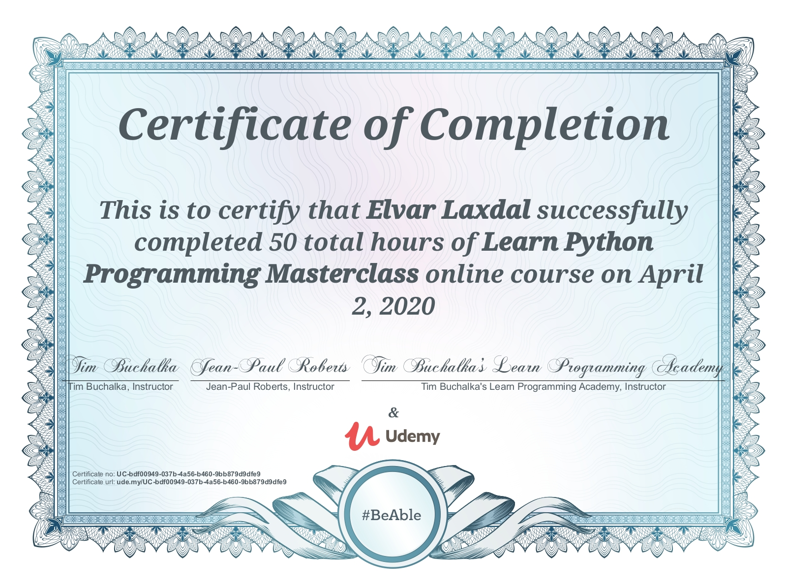

# Learn Python Programming Masterclass
All coursework for the Learn Python Programming Masterclass by Tim Buchalka and Jean-Paul Roberts.

[The Course at Udemy](https://www.udemy.com/course/python-the-complete-python-developer-course/)  
[The Learn Programming Academy](https://learnprogramming.academy/)

## Curriculum

- [x] Section 01 - Course Introduction
- [x] Section 02 - Install and Setup
- [x] Section 03 - Stepping into the World of Python
- [x] Section 04 - Program Flow Control in Python
- [x] Section 05 - Lists and Tuples
- [x] Section 06 - Functions - An Introduction
- [x] Section 07 - Dictionaries and Sets
- [x] Section 08 - Input and Output (I/O) in Python
- [x] Section 09 - Modules and Functions in Python
- [x] Section 10 - Object Oriented Python
- [x] Section 11 - Using Databases in Python
- [x] Section 12 - Generators, Comprehensions and Lambda Expressions
- [x] Section 13 - Packages
